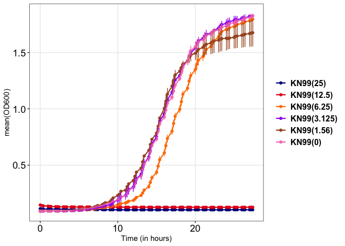
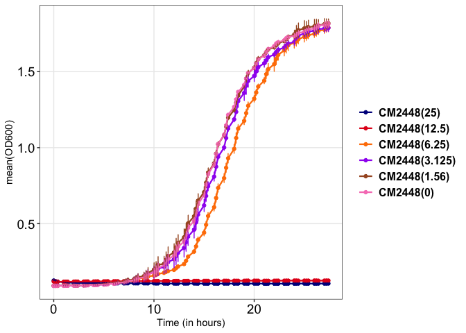

# SY-1365 Analysis

### enzyme assay

#### 

#### Enzyme assay pvalue at last time-point


## Growth Curves

### Dose response curve 2 fold serial dilution

Experimental setup

1.  Cells were grown overnight in YPD media
2.  OD for O/N cells (OD=28.84) was determined and diluted to OD600 =
    0.01/ml in 15ml (6.935µl) fresh YPD.
3.  Cells were aliquoted in 1ml tubes (14x)
4.  Mev stock (100mg/ml) and BS181 stock (40mg/ml) was serially diluted
    in DMSO and cells were treated with 1µl of Mev and 2.5µl of BS181
    from each dilution and only DMSO (0µg/ml) as control
5.  Cells were aliquoted in 96-well plate, 200µl/well.
6.  Cell growth was monitored by recording OD600 every 20min up-to 40hrs
    with constant shaking at 800rpm at 30C using [Agilent Biotek
    logphase
    600](https://www.google.com/url?sa=t&source=web&rct=j&opi=89978449&url=https://www.agilent.com/en/product/microplate-instrumentation/microplate-readers/multiplate-absorbance-reader/biotek-logphase-600-microbiology-reader-1623185&ved=2ahUKEwiTyenf3v2IAxWMh1YBHWNKFdMQFnoECBcQAQ&usg=AOvVaw0jzPdCYQNt27zqyw6PwRos)
    plate reader
7.  Cell growth is plotted as Time Vs OD600. Concentration is indicated
    in the brackets as µg/ml.

#### H99


Conclusions

1.  For Mev, 12.5µg/ml is the inhibitory concentration
2.  For BS181, 50µg/ml concentration shows complete inhibition
3.  Dose response assay shows that stark but not gradual inhibition in
    growth at the described concentration

#### CAK-tag





Conclusions

1.  WT-KN99 and Cdk7 tagged strains have MIC of 12.5µg/ml for Mevociclib
2.  The MIC values are same as Cn H99
3.  Together results suggests
    - Irrespective of strain (KN99 or H99) C. neoformans have same MIC
      for Cdk7 inhibitors

    - Adding tags to the Cdk7-complex does not alter the growth
      inhibition in presence of Cdk7 inhibitors

### Growth in liquid culture

#### For RNAseq, Western and Proteomics

With starting OD=4/mL and 60µg/mL SY-1365 treatment

``` r
growth_tube_dt <- tibble::tribble(
                    ~Time,       ~DMSO,     ~SY1365,
                     "1h", 140.7514451, 130.0578035,
                     "2h", 183.1213873, 153.0057803,
                     "3h", 228.9017341, 176.2427746,
                     "4h", 279.2196532,  211.734104,
                     "5h", 357.8034682, 243.3526012,
                    )

growth_tube_dt %>% 
  tidyr::gather(Sample, Percentage, -Time) %>%
  dplyr::mutate(Sample=forcats::as_factor(Sample)) %>%
  ggplot2::ggplot(ggplot2::aes(Time, Percentage, fill=Sample))+
  ggplot2::geom_col(color="black")+
  ggplot2::theme_bw()+
  ggplot2::facet_wrap(~Sample, scales="fixed")+
  ggplot2::scale_fill_manual(values=c("grey", "darkgreen","darkblue"))
```


#### For flow cytometry

``` r
dat_growth_curve  <- tibble::tribble(
                 ~Time, ~DMSO_1, ~DMSO_2, ~Mev_1, ~Mev_2,
                     0,   4.766,    4.73,  4.678,  4.676,
                   0.5,   6.416,   6.328,  5.868,  6.472,
                     1,   7.268,   7.052,  6.676,   6.44,
                     3,   15.27,   15.11, 10.455, 10.495,
                     5,   26.62,   26.61,  17.88,  17.58,
                    22,   42.46,    41.5,   41.7,  45.52
                 )


dat_growth_curve 
```

    # A tibble: 6 × 5
       Time DMSO_1 DMSO_2 Mev_1 Mev_2
      <dbl>  <dbl>  <dbl> <dbl> <dbl>
    1   0     4.77   4.73  4.68  4.68
    2   0.5   6.42   6.33  5.87  6.47
    3   1     7.27   7.05  6.68  6.44
    4   3    15.3   15.1  10.5  10.5 
    5   5    26.6   26.6  17.9  17.6 
    6  22    42.5   41.5  41.7  45.5 

``` r
column1 <- dat_growth_curve %>% colnames() %>% .[1]

dat_growth_curve <- dat_growth_curve %>% dplyr::rename(Time= column1)


dat_melt <- dat_growth_curve %>%
                  tidyr::gather(key="sample", value="OD", -Time) %>%
                  tidyr::separate(col = sample,into = c("condition","replicate"),sep="_")


summ_dat <- dat_melt %>%
            dplyr::mutate(condition=forcats::as_factor(condition),Time=forcats::as_factor(Time)) %>%
            dplyr::group_by(.dots = c("Time", "condition"))  %>%
            dplyr::mutate(sd = sd(OD), mean=mean(OD)) %>%
            dplyr::filter(replicate==min(replicate)) %>%
            dplyr::select(-c(replicate)) 


ggplot2::ggplot(summ_dat, ggplot2::aes(x = Time, y = mean, fill = condition, group=condition)) +
              ggplot2::geom_col(position=ggplot2::position_dodge(width = 0.8), width = 0.7) +
  ggplot2::geom_errorbar(ggplot2::aes(ymin = mean - sd, ymax = mean + sd), 
                position = ggplot2::position_dodge(width = 0.8),
    width = 0.2, linewidth = 0.6) +
    ggplot2::ylab("mean(OD600)") +
    ggplot2::scale_fill_manual(values=c("blue4","red4"))+
    ggplot2::theme_bw()
```


### Phospho-proteomics

#### Phospho-proteomics

``` r
phospho_tb <- readr::read_delim("data_files/Phospho_RawData.txt", delim="\t", col_names = TRUE)

phospho_tb <- phospho_tb %>% 
  dplyr::filter(stringr::str_starts(Accession, "CNAG")) %>%
  dplyr::rowwise() %>% # remove rows with no abundance reported
  dplyr::filter(!all(is.na(dplyr::c_across(c(Abundances_With, Abundances_Without)))))

# remove rows having peak "Not found" in both the replicate
phospho_tb_mev <- phospho_tb %>%
                  dplyr::select(c(Accession, Sample_With_1,Sample_With_2)) %>%
                  dplyr::rowwise() %>%
                  dplyr::filter(sum(dplyr::c_across(2:3) != "Not Found") == 2) %>%
                  dplyr::ungroup()

phospho_tb_untreated <- phospho_tb %>%
                  dplyr::select(c(Accession, Sample_Without_1,Sample_Without_2)) %>%
                  dplyr::rowwise() %>%
                  dplyr::filter(sum(dplyr::c_across(2:3) != "Not Found") == 2) %>%
                  dplyr::ungroup()

# create a combined list of mev and untreated

phospho_combined_list <- dplyr::bind_rows(
                            phospho_tb_untreated %>% dplyr::select(Accession),
                           phospho_tb_mev %>% dplyr::select(Accession)
                          ) %>%
                          dplyr::distinct()


phospho_filtered <- phospho_tb %>%
                  dplyr::filter(Accession %in% phospho_combined_list$Accession) %>%
                  dplyr::mutate(LFC = log2(Abundances_With/Abundances_Without),
                                class=dplyr::if_else(LFC>1, "Up",
                                      dplyr::if_else(LFC< -1, "Down", "No-change"))) %>%
                  dplyr::mutate(class=dplyr::if_else(is.na(Abundances_Without), "Mev_Only", dplyr::if_else(is.na(Abundances_With), "WT_Only", class)))

Phospho_stats <- phospho_filtered %>% 
  dplyr::count(class) 

Phospho_stats <- tibble::tribble(
                        ~class,   ~n,
                          "Up", 134L,
                   "No-change", 466L,
                        "Down", 189L,
                    "Mev_Only",  40L,
                     "WT_Only",  14L
                   )

Phospho_stats %>% 
  dplyr::mutate(class=forcats::as_factor(class)) %>%
            ggplot2::ggplot(ggplot2::aes(class, n, label=n, fill=class))+
            ggplot2::geom_col(alpha=0.8, color="black") +
            ggplot2::theme_bw()+
            ggplot2::geom_text(vjust=-1)+
            ggplot2::scale_fill_manual(values=c("red", "gray", "blue", "salmon", "cyan4"))
```


``` r
# combine WT_only to Down and Mev_Only to Up

Phospho_stats_2 <- phospho_filtered %>% 
                  dplyr::mutate(class2=dplyr::if_else(class=="WT_Only", "Down", dplyr::if_else(class=="Mev_Only", "Up", class))) %>% dplyr::count(class2)

Phospho_stats_2 %>% dplyr::ungroup() %>% 
            dplyr::arrange(desc(class2)) %>% 
            dplyr::mutate(class2=forcats::as_factor(class2)) %>%
            ggplot2::ggplot(ggplot2::aes(class2, n, label=n, fill=class2))+
            ggplot2::geom_col(alpha=0.8, color="black") +
            ggplot2::theme_bw()+
            ggplot2::geom_text(vjust=-1)+
            ggplot2::scale_fill_manual(values=c("red", "gray", "blue"))
```


#### LCMS

``` r
lcms_dat = readr::read_delim("data_files/LCMS_RawData.txt", delim="\t")

# filter-out rows having "Not found" in atleast 2 of the three replicates

lcms_dat_Mev <- lcms_dat %>%
                  dplyr::select(c(Accession, Sample_With_1,Sample_With_2,Sample_With_3)) %>%
                  dplyr::rowwise() %>%
                  dplyr::filter(sum(dplyr::c_across(2:4) != "Not Found") >= 2) %>%
                  dplyr::ungroup()

lcms_dat_WT <- lcms_dat %>%
  dplyr::select(c(Accession, Sample_Without_1,Sample_Without_2,Sample_Without_3)) %>%
  dplyr::rowwise() %>%
  dplyr::filter(sum(dplyr::c_across(2:4) != "Not Found") >= 2) %>%
  dplyr::ungroup()

combined_genelist <-  dplyr::bind_rows(
                            lcms_dat_WT %>% dplyr::select(Accession),
                            lcms_dat_Mev %>% dplyr::select(Accession)
                          ) %>%
                            dplyr::distinct()
lcms_filtered <- lcms_dat %>%
                  dplyr::filter(Accession %in% combined_genelist$Accession) %>%
                  dplyr::rowwise() %>%
                  dplyr::filter(!any(is.na(dplyr::c_across(c(Abundances_With, Abundances_Without))))) %>%
                  dplyr::filter(stringr::str_starts(Accession, "CNAG")) %>%
                  dplyr::mutate(LFC = log2(Abundances_With/Abundances_Without),
                                class=dplyr::if_else(LFC>1, "Up",
                                                     dplyr::if_else(LFC< -1, "Down", "No-change")))


LCMS_stats <- lcms_filtered %>% 
                    dplyr::count(class) %>%
                    dplyr::ungroup() %>% 
                    dplyr::arrange(desc(class)) %>% 
                    dplyr::mutate(class=forcats::as_factor(class))

LCMS_stats %>% ggplot2::ggplot(ggplot2::aes(class, n, label=n, fill=class))+
            ggplot2::geom_col(alpha=0.8, color="black") +
            ggplot2::theme_bw()+
            ggplot2::geom_text(vjust=-1)+
            ggplot2::scale_fill_manual(values=c("red", "gray", "blue"))
```


#### Compare LCMS and Phospho-proteomics

``` r
dat_venn1 <- readr::read_delim("data_files/LCSM_Phosph_VennInput.txt", delim="\t", col_names =TRUE)


gg_1 = as.list(dat_venn1)

v1 = lapply(gg_1,unique)


clean_list <- lapply(v1, function(x) x[!is.na(x)])


lengths(clean_list)
```

    No-change_LCMS  No-change_Pho       Down_Pho         Up_Pho 
              2601            466            203            174 

``` r
names(clean_list)=factor(names(clean_list))
upset_venn1 <- UpSetR::upset(UpSetR::fromList(clean_list), 
          nsets = ncol(dat_venn),
          #order.by = c("degree"),
          keep.order=TRUE,sets=names(clean_list),
          sets.bar.color = c( "grey","blue", "red", "red"),
          text.scale=2, sets.x.label = "No. of genes")

print(upset_venn1)
```


``` r
# Convert matrix to tidy format
UpSetR::fromList(clean_list) %>%
        dplyr::mutate(gene = rownames(.)) %>%
        tidyr::pivot_longer(-gene, names_to = "set", values_to = "present") %>%
  dplyr::filter(present == 1) %>%
  dplyr::group_by(gene) %>%
  dplyr::summarise(sets = paste(sort(set), collapse = ",")) -> gene_intersections

# See genes per intersection
table(gene_intersections$sets)
```


                        Down_Pho      Down_Pho,No-change_LCMS 
                              81                          122 
                  No-change_LCMS No-change_LCMS,No-change_Pho 
                            2139                          254 
           No-change_LCMS,Up_Pho                No-change_Pho 
                              86                          212 
                          Up_Pho 
                              88 

#### 
