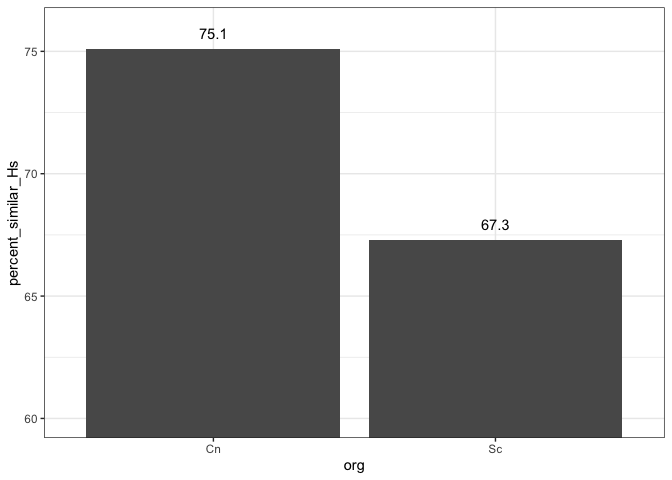

# Cdk7_paper_figure

### Percent similarity



### Functional insights into CnCDK7 using CDK7 inhibitors

1.  [SY-1365](https://github.com/sethiyap/CnCDK7_analysis/blob/main/Paper_SY-1365.md)

### RNASeq data processing and QC

#### Alignment statistics

``` r
library(magrittr)

star_dir <- "/Users/pooja/Documents/CDK7_project/RNASeq/RNASe1_1h_Mev_BS181/BAM/"

star_align_log_files <- fs::dir_ls(star_dir, 
                                   glob = "*Log.final.out" ,
                                   recurse = T,type = "file")

names(star_align_log_files) <- gsub(x=basename(star_align_log_files), pattern ="*_star_alignLog.final.out", replacement = "")

parcutils::get_star_align_log_summary_plot(x = star_align_log_files,
                                col_total_reads = "red3", 
                                col_mapped_reads  = "blue4") 
```


#### Generate count matrix using Rsubread

``` r
source("run_rsubread.R")
library(magrittr)

gff_file <- "/Users/pooja/Documents/CDK7_project/RNASeq/RNASeq_1h_2022/GENOME/FungiDB-59_CneoformansH99.gff"


dir = list.files(star_dir, pattern = "*.bam$", full.names = TRUE)

cc <- run_rsubread(dir = dir, gff_file = gff_file)

readr::write_delim(cc, file = "/Users/pooja/Documents/CDK7_project/RNASeq/RNASe1_1h_Mev_BS181/Mev_BS181_1h_read_count.txt", delim = "\t")
```

#### DESeq for differential gene expression and normalized count matrix

``` r
library(magrittr)

cc <- readr::read_delim( "/Users/pooja/Documents/CDK7_project/RNASeq/RNASe1_1h_Mev_BS181/Mev_BS181_1h_read_count.txt", delim="\t", col_names = TRUE) %>% 
  dplyr::select(
    gene_name,dplyr::matches("^WT_DMSO|^WT_BS|^WT_Mev"))

sample_info <- cc %>% colnames() %>% .[-1]  %>%
              tibble::tibble(samples = . , groups = rep(c( "WT_BS181_1h", "WT_DMSO", "WT_Mev") , each = 3)) 


knitr::kable(sample_info)
```

| samples                    | groups      |
|:---------------------------|:------------|
| WT_BS181_1h_1              | WT_BS181_1h |
| WT_BS181_1h_2              | WT_BS181_1h |
| WT_BS181_1h_3              | WT_BS181_1h |
| WT_DMSO_Set1               | WT_DMSO     |
| WT_DMSO_Set2_sampled_reads | WT_DMSO     |
| WT_DMSO_Set3               | WT_DMSO     |
| WT_Mevo_Set1               | WT_Mev      |
| WT_Mevo_Set2               | WT_Mev      |
| WT_Mevo_Set3               | WT_Mev      |

``` r
control=c("WT_DMSO")
treatment = c("WT_BS181_1h", "WT_Mev")

res <- parcutils::run_deseq_analysis(counts = cc ,
                         sample_info = sample_info,
                         column_geneid = "gene_name" ,
                         cutoff_lfc = 1,
                         cutoff_pval = 0.05,
                         min_counts = 10,
                         group_numerator = treatment,
                         group_denominator = control,
                         regul_based_upon = 1)
```

#### Normalized count matrix

``` r
norm_mat <- parcutils::get_normalised_expression_matrix(x = res, 
                                            samples = NULL,
                                            genes = NULL,
                                            summarise_replicates = FALSE, 
                                            )
```

### Data quality assessment

#### Correlation between replicates

``` r
parcutils::get_corr_heatbox(x = res, show_corr_values = T, cluster_samples = F, plot_type = "lower")
```


#### PCA plot

``` r
parcutils::get_pca_plot(x = res, label_replicates = TRUE)
```


### 
